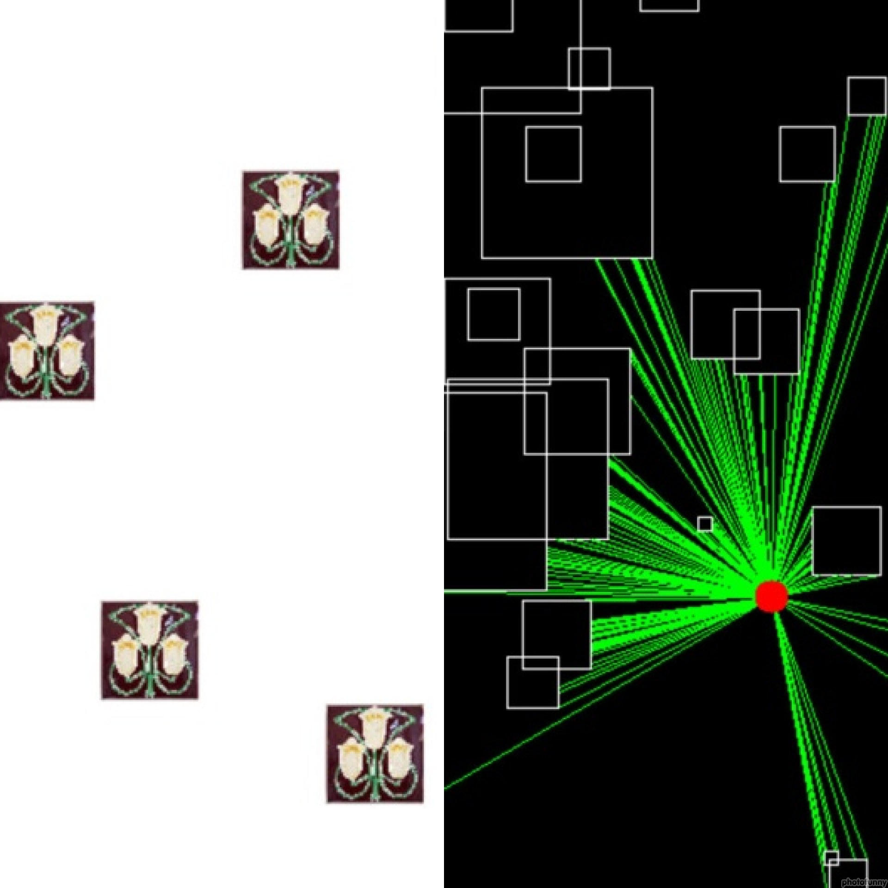

# 2D Software Rasterizer

### Project Preview

## Features 
⚡️ Line, Sphere and Triangle Rasterizations
⚡️ Space Transformations
⚡️ Shading
⚡️ Sampling
⚡️ Viewports
⚡️ Blending
⚡️ Cameras
⚡️ Clipping and Culling
  
## Demo Stages

					    Sprite Sheet Animation
---------------------------------------------------------------------------------------------------------
You can adjust the tileset rendering options using the GUI provided, such as:
-Number of Rows
-Number of Columns
-Playback speed
-Loop
-Animation Tileset

You are also allowed to pause and reset the animation at any time.

					    Texture Transformation
---------------------------------------------------------------------------------------------------------
You can adjust the rendering options using the GUI provided, when tiling, you can change:
-Tiling Options
-Horizontal Tiles 
-Vertical Tiles
-Size of Image

When Cropping you can:
-Adjust the cropping edges via GUI
-Crop using the mouse (Left click to select starting point, then move the mouse to cover the desired area and 
	left click again)

In all instances, you can change the sprite used.
Disclaimer: Cropping a Tiled image was not implemented.

					     	 Tile Map
---------------------------------------------------------------------------------------------------------
You may adjust the rendering optimizations of the tilemap with the presets shown on the GUI.
You are also able to Save and Load Tilemaps (A sample tilemap is provided in Data/Sample Tilemaps/).
The camera is movable through the ASDW keys.

					      Polygon Editor
---------------------------------------------------------------------------------------------------------
Create a new polygon by Clicking "Create new polygon" and add Vertices by cliking into the window.
Once you have created a Polygon, you will be able to select it from the palete and:
-Change it's name.
-Delete it.
-Change it's vertex position values.
Disclaimer: UV's do have bugs.

					       Image Ereaser
---------------------------------------------------------------------------------------------------------
You may place images on the screen with Right Click while holding SHIFT
You can erease the image by pressing CTRL and moving the mouse around the window while you keep the right mouse button pressed
More options are available through the GUI, such as:
-Change the Object name.
-Make the Object Rotate over time
-Change Background Color.
-Select a new Sprite (which will be applied to the new objects)
-Reset the Scene.

					      	   Culling
---------------------------------------------------------------------------------------------------------
Objects will be randomly generate a scene. You will be able to move the camera through the WASD keys.
The GUI will allow you to toogle Culling on and off. If culling is activated, you will also be able to activate Forward culling for an even more noticeable performance boost.
You can change the sprite of the objects with the "Change sprite button"
You can right click on the window to place new objects.
The number of rendered objects will be displayed on the screen and updated real-time.

						   Lighting
---------------------------------------------------------------------------------------------------------
Disclaimer: This Demo is partially implemented
You can move the mouse over the scene to see how the light casting works in a 2D scene.
You can Press CTRL to light the scene using Polygon Drawing (contains some bugs).

## Installation & Deployment 📦
- Clone the repository
- Open and build using Visual Studio 2023

## Tools Used 🛠️
* <b>Alpha Engine</b> - Minimal API to display framebuffers onto the screen. We also use it's math library, and window creating utilities.

## License

- **[MIT license](http://opensource.org/licenses/mit-license.php)**

NOTE: All images used in this project are copyright-free and available for non-commercial use
